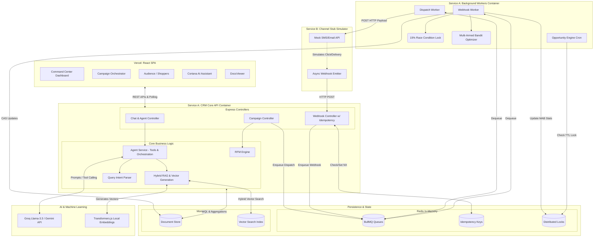

# Project Cortex

Project Cortex is an intelligent, automated CRM engine that combines deterministic RFM (Recency, Frequency, Monetary) mathematics with generative AI to identify opportunities and orchestrate A/B/C tested engagement campaigns. 

Unlike traditional passive CRMs, Project Cortex functions as an active revenue engine, utilizing semantic AI and deterministic logic to form a continuous loop: Understand, Discover, Execute, and Learn. 

For a high-level overview of the philosophy and system design, see the [System Blueprint](docs/blueprint.md).

## System Architecture

Cortex is built on a distributed, decoupled monorepo architecture:

* **Service A (CRM Core)**: Node.js/Express API handling models, RFM calculations, and campaign orchestration.
* **Service A (Workers)**: Isolated Node.js BullMQ workers processing the heavy lifting of campaign dispatch, webhook ingestion, and AI embeddings.
* **Service B (Channel Stub)**: Simulates an SMS/Email provider like Twilio or Sendgrid. It acknowledges dispatches and fires delivery/engagement webhooks back to Service A asynchronously.
* **Frontend Dashboard**: A lightweight, modern React (Vite) single-page application connecting to the core API. Hosted and served dynamically.
* **MongoDB Atlas**: Primary datastore and Vector Database for Semantic Search.
* **Redis**: Queue backend (BullMQ), idempotency locks, distributed cron locks, and high-speed Multi-Armed Bandit counters.



For an in-depth look at the architecture and strategic design choices, refer to [Architecture and Trade-offs](docs-deep-dive/01-architecture-and-tradeoffs.md).

## Core Features and Capabilities

Project Cortex provides an expansive set of features designed to automate and optimize marketing operations:

* **Command Center**: The primary hub for system telemetry and high-level campaign metrics. See [Command Center Features](docs/features/command-center.md) and [Telemetry and ROI Deep Dive](docs-deep-dive/05-telemetry-and-roi.md).
* **AI Assistant (Cortana)**: An integrated LLM-powered chatbot to interrogate data, discover segments, and initiate campaign drafts. See [Cortana Features](docs/features/cortana.md).
* **Campaign Orchestration**: Tools for building and deploying marketing campaigns with complex targeting. See [Campaigns Features](docs/features/campaigns.md).
* **Multi-Armed Bandit (MAB) Engine**: Automatically optimizes message variant distribution based on real-time engagement data. See [MAB Engine Features](docs/features/mab-engine.md) and [MAB Execution Engine Deep Dive](docs-deep-dive/04-mab-execution-engine.md).
* **Audience Management (Shoppers)**: Deterministic ingestion layer evaluating user behavior via RFM scores to identify optimal targets. See [Shoppers Features](docs/features/shoppers.md) and [Data Ingestion and RFM Deep Dive](docs-deep-dive/02-data-ingestion-and-rfm.md).
* **Hybrid RAG Pipeline**: Combines MongoDB vector search and deterministic filtering to power the AI capabilities. See [Hybrid RAG Pipeline Deep Dive](docs-deep-dive/03-hybrid-rag-pipeline.md).

## Production Defenses and Security

The system includes multiple critical mechanisms to ensure reliability under production loads and protect against data anomalies:

1. **The 15% Race Condition Lock** (`webhook.worker.ts`): Uses atomic MongoDB `findOneAndUpdate` (Compare-And-Swap) to ensure only ONE worker transitions the campaign to an optimizing state and dispatches the remaining 85%, preventing double-sends.
2. **The Minimum-Volume Gate** (`dispatch.worker.ts`): Prevents campaigns from aborting prematurely due to early failure spikes by enforcing a 5% sample threshold before evaluating failure rates.
3. **Namespaced Idempotency** (`webhook.controller.ts`): Uses Redis `SET NX EX 86400` with keys like `webhook:provider:campaignId:messageId` to drop duplicate webhooks with a fast HTTP 200 OK response.
4. **Distributed Cron Locks** (`opportunityEngine.cron.ts`): Prevents the nightly Opportunity Engine from executing multiple times if Service A is horizontally scaled, using a 1-hour Redis TTL lock.
5. **Human-in-the-Loop (HITL)**: All mutating tool-calls orchestrated by the LLM must stage via the React frontend and require human cryptographic signing to execute, ensuring the AI cannot autonomously mutate production records. Read more in [HITL Security and Parsing](docs-deep-dive/06-hitl-security-and-parsing.md).

## Getting Started

### Prerequisites

* Node.js 20 or higher
* MongoDB Atlas cluster (must have a `vectorSearch` index configured on `ai.embeddingVector` for the Shoppers collection)
* Redis server (must support authentication if configured)
* Google Gemini or Groq API Key (depending on current configuration)

### Option 1: Native Run

1. Clone the repository and install dependencies for the microservices:
   ```bash
   cd project-cortex
   cd service-a-crm && npm install
   cd ../service-b-channel-stub && npm install
   cd ../client && npm install
   ```

2. Configure Environments:
   Add your respective keys to `service-a-crm/.env` and `service-b-channel-stub/.env`. Example files are provided in the directories.

3. Start the services concurrently:
   ```bash
   # Terminal 1: Core API & Workers (service-a-crm runs both via Docker or concurrently)
   cd service-a-crm && npm run dev:api
   
   # Terminal 2: BullMQ Workers
   cd service-a-crm && npm run dev:workers
   
   # Terminal 3: Channel Stub Simulator
   cd service-b-channel-stub && npm run dev
   
   # Terminal 4: Frontend Application
   cd client && npm run dev
   ```

### Option 2: Docker Compose

You can boot the entire backend stack natively with Docker Compose. This automatically spins up a local Redis instance and links the core API, workers, and stub services.

```bash
docker-compose up --build
```
*Note: Ensure `.env` files are populated and MongoDB connection strings are reachable from the Docker network.*

## Known Architectural Debt

While Project Cortex is designed for high concurrency and scale, the following areas represent deferred architectural decisions meant for future evolution:

1. **No Dead Letter Queues (DLQs)**: Failing jobs currently log errors to standard output but lack automated DLQ routing. Implementing true DLQs and retry backoff strategies is required for resilient async processing.
2. **Vector Database Syncing**: Relying on MongoDB Atlas for both document storage and vector search is convenient but couples CRM schema with dense vector data, which can become cost-prohibitive. Dedicated external vector databases (like Pinecone or Milvus) are recommended for long-term scale.
3. **LLM Hallucination Monitoring**: Fallbacks to hardcoded templates exist if the LLM produces invalid JSON, but semantic monitoring for inappropriate marketing copy generation is lacking. 
4. **Monolithic Repository**: `service-a-crm` houses both the Express API and the BullMQ Workers. Though they run as separate processes, decoupling them into individual deployment pipelines would adhere closer to a true microservice architecture.