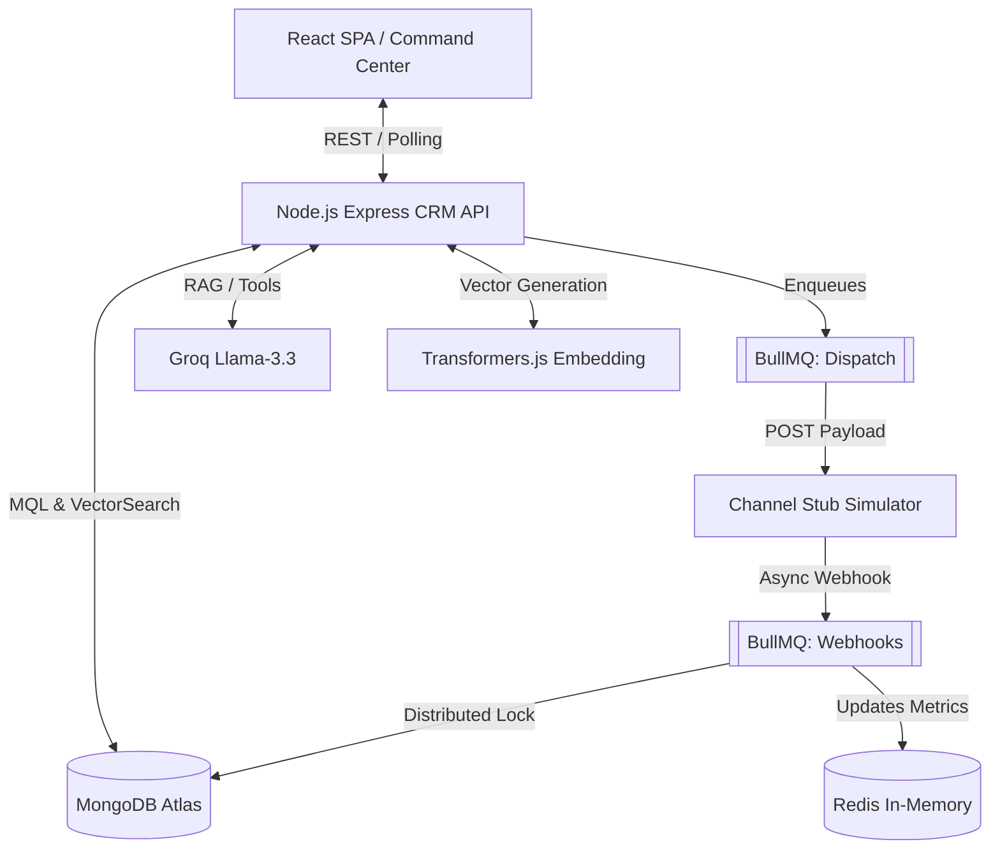

# Architectural Topography & Strategic Trade-offs

## 1. System Topography (Monorepo)
Project Cortex is structured as a decoupled monorepo to strictly isolate the execution environment from the simulation environment.

## 2. Rejected Alternatives (The "Why")

### Trade-off 1: BullMQ + Redis vs. Apache Kafka

**Decision:** We explicitly rejected Kafka for our execution engine.

**Justification:** Kafka is an append-only event streaming log designed for massive, durable data replay. Cortex requires job orchestration. BullMQ provides native job retries, rate-limiting, delayed execution, and strict concurrency controls out-of-the-box. Implementing a Multi-Armed Bandit with delayed 15% exploration thresholds in Kafka requires building complex custom consumer offset logic. BullMQ solves this natively via Redis, which we already require for atomic counter increments.

### Trade-off 2: Transformers.js vs. OpenAI text-embedding-3-small

**Decision:** Local embeddings via Hugging Face (Xenova/all-MiniLM-L6-v2) over cloud APIs.

**Justification:** Data ingestion of 100,000 Golden Records via OpenAI incurs immediate cost and exposes the pipeline to HTTP 429 Too Many Requests rate limits. By running Transformers.js within the Node.js process:

- Cost: $0.00.
- Latency: Near-zero network overhead; execution is bound only by local CPU/RAM.
- Dimensions: It produces an efficient 384-dimension vector, drastically reducing the MongoDB Atlas RAM footprint compared to OpenAI's 1536 dimensions, resulting in faster `$vectorSearch` traversal times.

### Trade-off 3: Human-in-the-Loop (HITL) vs. Autonomous Database Mutability

**Decision:** The Groq Agent has read-only access to MongoDB. All mutating tool-calls must stage via the React frontend.

**Justification:** Autonomous agents suffer from non-deterministic output drift. Giving an LLM direct INSERT/UPDATE privileges on a production CRM database is an unacceptable risk. The HITL architecture treats the LLM as an orchestrator that proposes a cryptographic payload. The React client intercepts this payload, enforces UI-level validation, and requires human cryptographic signing (a button click) to execute the REST API mutation.
